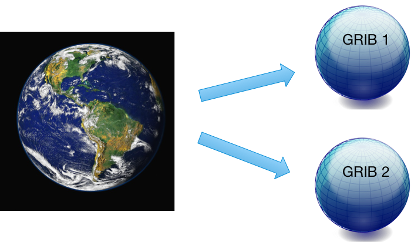
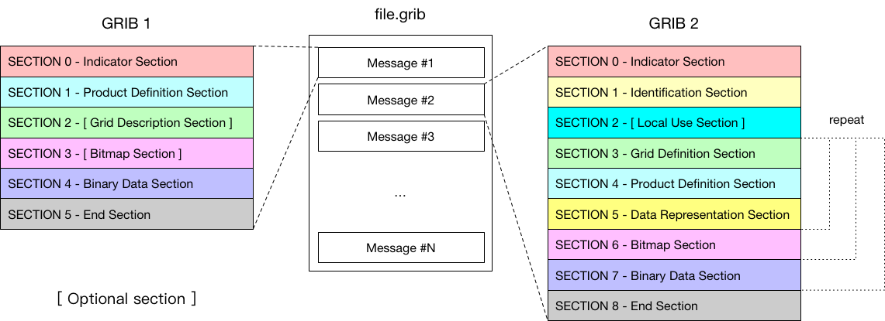
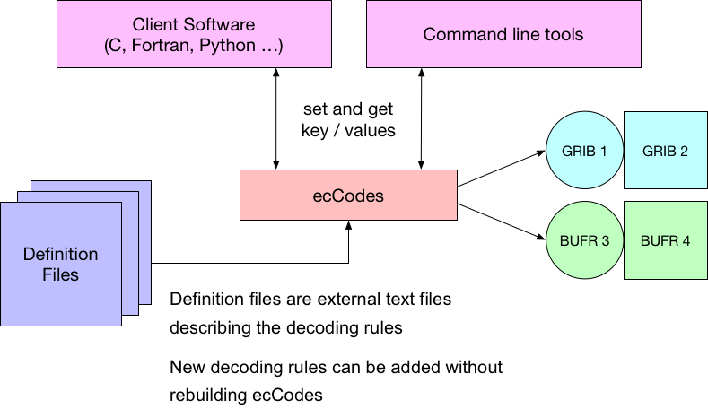

## 什么是GRIB？

GRIB是由世界气象组织 (World Meteorological Organization，WMO)维护的二进制文件格式。
用于编码由数值天气预报模式(Numerical Weather Prediction models)生成的数据。



GRIB 最初是 GRIdded Binary 的缩写，后来被扩展为 General Regularly-distributed Information in Binary form。

## GRIB文件长什么样？

GRIB 格式是面向二进制的数据交换格式，与文本文件等人类可读的文件不同，必须由符合WMO标准规则的软件解码。

下图是使用16进制编辑器打开 GRIB 文件的示例，除了最开始4个字节外，其余部分都无法解析成文本，后面将会看到前4个字节对应的 ASCII 编码内容 GRIB 正是 GRIB 文件的标志。


## WMO 二进制编码

WMO 提供对 GRIB 编码标准的完整描述文件 Manual on Codes。

这是 WMO 二进制编码 GRIB 的唯一官方文档，可以从 WMO 的官网上获取。

 [http://www.wmo.int/pages/prog/www/WMOCodes.html](http://www.wmo.int/pages/prog/www/WMOCodes.html)

每三年发布完整的说明文档。

每年两次发布作为新版本的代码表格，代码表格是说明文档的一部分。

最新版本的表格请访问 WMO 网站

[http://www.wmo.int/pages/prog/www/WMOCodes/WMO306_vI2/LatestVERSION/LatestVERSION.html](http://www.wmo.int/pages/prog/www/WMOCodes/WMO306_vI2/LatestVERSION/LatestVERSION.html)

## GRIB 版本1和2

目前可以使用两个不同版本的 GRIB 编码标准（版本1和版本2）。两个版本的编码规则相似，但他们的实现方式完全不同。



## GRIB结构

GRIB是一种基于表格的存储格式，下面简单介绍 GRIB 的文件结构，详情请查阅相关资料。

一个 GRIB 文件由一个或多个 GRIB 消息构成。

每个消息包含多个部分（sections）构成。

数据描述符是自定义的，相关信息保存在 GRIB 的表格和模板中。

单个文件可以混合保存版本1和版本2。



### GRIB 1与GRIB 2的主要区别

GRIB 1 和 GRIB 2 的结构不同，他们都由 section 构成，但代表不同的含义。

在 GRIB 2 中，多个变量使用更高的精度定义。

- GRIB 1 的经纬度使用 mili-degrees
- GRIB 2 的经纬度使用 micaro-degrees

GRIB 2 的经度值必须在0到360度之间。

两个版本的变量编码也不一样。GRIB 2 中数据的信息（变量、时间、统计值、网格等）基于模板（template）和表格（table）描述，更加灵活，但同时也更加复杂。

### 历史数据

GRIB 1 是 遗留的 WMO 编码，已不再被 GTS exchange 接收。新版本的表格和模板只面向 GRIB 2。

#### GRIB 2 在 ECMWF 的使用

从2011年5月18日起，HRES的所有模式层变量都使用 GRIB 2 编码。

大部分地面层和气压层变量都使用 GRIB 1 编码，部分近期引入的地面变量使用 GRIB 2 编码（例如 ptype）。

未来会将 GRIB 1 的要素迁移到 GRIB 2。

#### 不会被迁移

- 海浪模式
- The System-4 seasonal forecast model
- ERA-Interim

## ecCodes 介绍

ecCodes 是有 ECMWF 开发的解码和编码工具包，用于处理下面的数据格式：

- WMO FM-92 GRIB 版本1和2
- WMO FM-94 BUFR 版本3和4
- WMO GTS abbreviated header

本教程将只介绍 GRIB 格式。

ecCodes 库包括：

- API接口
- 一组命令行工具（GRIB Tools），提供对数据的便捷操控功能
- 提供工具库主要功能的 Fortan 90，C 和 Python 接口

ecCodes 为用户提供高层的访问方式，隐藏 GRIB 消息的二进制层，
提供方便可靠的方式编码和解码 GRIB 1 和 GRIB 2 的消息，
使用同样的函数编解码两个版本的 GRIB 消息，同时 ecCodes 可以很容易地更新到最新版本的 GRIB 模板和表格。

### 与 GRIB-API 的关系

ecCodes 的前身就是的 GRIB-API，ecCodes 是后者的升级（添加对 BUFR 格式）的支持。

对于 GRIB 编解码，ecCodes 提供与 GRIB-API 同样的功能。
目前 ecCodes 是 ECMWF 使用的主要 GRIB 编解码工具。
ecCodes 最终将完全替代 GRIB-API。

ecCodes 使用 Apache 2.0 许可证。


### ecCodes 与更早期的软件对比

早期基于 Fortran 的工具提供对 GRIB 消息基于数组的访问方式。例如：

- ksec2(2) => 纬度圈格点个数
- ksec2(3) => 经度圈格点个数

ecCodes 提供基于键值对的访问方式。例如：

- NumberOfPointsAlongAParallel => 经度圈格点个数
- NumberOfPointsAlongAMeridan => 纬度圈格点个数

### ecCodes 架构



### ecCodes 与 GRIB 版本1和版本2

<table>
<tbody>
<tr>
  <td>GRIB 1 编码</td>
  <td>latitudeOfFirstGridPoint=40000</td>
</tr>
<tr>
  <td>GRIB 2 编码</td>
  <td>latitudeOfFirstGridPoint=40000000</td>
</tr>
<tr>
  <td>ecCodes计算值</td>
  <td>latitudeOfFirstGridPointInDegrees=40</td>
</tr>
</tbody>
</table>

<table>
<tbody>
<tr>
  <td>GRIB 1 编码</td>
  <td>
    dataRepresentationType=4<br />
    numberOfPointAlongAParallel=MISSING<br />
    ijDirectionIncrementGiven=0<br />
    pl ={...}
  </td>
</tr>
<tr>
  <td>GRIB 2 编码</td>
  <td>
    ridDefinitionTemplateNumber=40<br />
    numberOfPointsAlongAParallel=MISSING<br />
    iDirectionIncrementGiven=0<br />
    iDirectionIncrement=MISSING<br />
    pl={...}
  </td>
</tr>
<tr>
  <td>ecCodes计算值</td>
  <td>gridType=reduced_gg</td>
</tr>
</tbody>
</table>

### 接口

所有接口都提供设置/读取 GRIB 消息中键值对的方法，每类接口的键值对均相同。

- C接口提供所有的功能（工具库用C语言编写）
- Fortran 90接口提供主要的功能。
- Python 接口通过访问 C 函数提供功能。
- Tools 提供命令行工具。

#### C接口

```c
h = codes_handle_new_from_file(context, in, PRODUCT_GRIB, &err);

codes_get_double(h, "latitudeOfFirstGridPointInDegrees", &lat1); 
codes_set_long(h, "centre", centre);
codes_set_string(h, "date", date, &len);

codes_handle_delete(h);
```

> 注意：为了兼容 grib_api，ecCodes 依然支持以 grib_ 开头的函数。

#### Fortran 90接口

```fortran
call codes_new_from_file(ifile, igrib, CODES_PRODUCT_GRIB, iret)

call codes_get(igrib, 'latitudeOfFirstGridPointInDegrees', lat1) 
call codes_set(igrib, 'centre', centre)
call codes_set(igrib, ‘date', ’20070212’)

call codes_release(igrib)
```

> 注意：为了兼容 grib_api，ecCodes 依然支持以 grib_ 开头的函数。

#### Python 接口

```python
gid = codes_new_from_file(f, CODES_PRODUCT_GRIB)

lat = codes_get(gid, 'latitudeOfFirstGridPointInDegrees') 
codes_set(gid, 'centre', centre)
codes_set(gid, 'date', date)

codes_release(gid)
```

> 注意：为了兼容 grib_api，ecCodes 依然支持以 grib_ 开头的函数。

#### Tools

```bash
grib_get –p latitudeOfFirstGridPointInDegrees input.grib 
grib_set –s centre=ecmf,date=20070212 input.grib out.grib
```

### 下载和安装

ecCodes 使用 CMake 编译和安装。

CMake 是跨平台的免费软件，使用与编译器无关的方式管理软件的过程。

从如下网址下载 ecCodes：

    https://software.ecmwf.int/wiki/display/ECC/Releases

从如下网址获取安装说明：

    https://software.ecmwf.int/wiki/display/ECC/ecCodes+installation

#### 安装要求

Linux 或者 Mac 平台

- 较新版本的 CMake （版本大于 2.8.11）和 GNU Make
- C 编译器 （gcc，icc，craycc）

可选，但推荐安装：

- Fortran 编译器：用于 Fortran 接口
- Python：用于 Python 接口
- Jasper/OpenJPEG：用于 jpeg 解码
- netCDF/netCDF4：用于 grib_to_netcdf 转换工具

编译命令示例：

```
$> tar -xzf  eccodes-x.y.z-Source.tar.gz
$> mkdir build ; cd build
$> PREFIX=/path/to/where/you/install/eccodes
$> cmake -DCMAKE_INSTALL_PREFIX=$PREFIX ../eccodes-x.y.z-Source
...
$> make
$> ctest
$> make install
```

## 帮助和支持

提交bug，请联系

Software.Support@ecmwf.int

Wiki：

https://software.ecmwf.int/wiki/display/ECC/ecCodes+Home

请使用论坛讨论一般问题：

https://software.ecmwf.int/wiki/display/ECC/Forums
