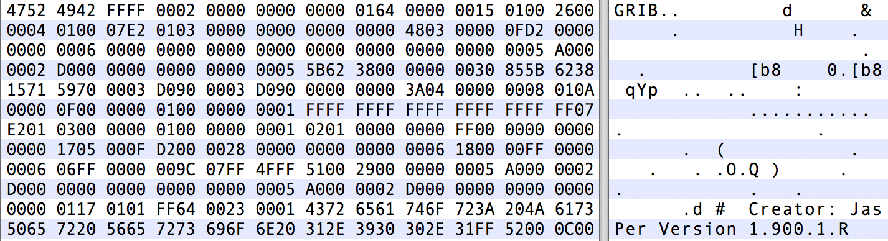

## 什么是GRIB？

**G**erneral

**R**egularly-distributed

**I**nformation in

**B**inary form

GRIB是由世界气象组织 (World Meteorological Organization，WMO)的基本系统委员会（Commission for Basic Systems, CBS）在1985年定义的二进制文件格式，用于大量格点数据的交换。
广泛应用于编码由数值天气预报模式(Numerical Weather Prediction models)生成的数据。

GRIB 最初是 GRIdded Binary 的缩写，后来被扩展为 General Regularly-distributed Information in Binary form。



## GRIB文件长什么样？

GRIB 格式是面向二进制的数据交换格式，无法直接阅读，需要使用软件进行解码和编码。

下图是使用16进制编辑器打开 GRIB 文件的示例，除了最开始4个字节外，其余部分都无法解析成文本。
后面将会看到前4个字节对应的 ASCII 编码内容 GRIB 正是 GRIB 文件的标志。

## WMO 二进制编码

WMO 提供对 GRIB 编码标准的完整描述文件 Manual on Codes。

这是 WMO 二进制编码 GRIB 的唯一官方文档，可以从 WMO 的官网上获取。

 [http://www.wmo.int/pages/prog/www/WMOCodes.html](http://www.wmo.int/pages/prog/www/WMOCodes.html)

每三年发布完整的说明文档。

每年两次发布作为新版本的代码表格，代码表格是说明文档的一部分。

最新版本的表格请访问 WMO 网站

[http://www.wmo.int/pages/prog/www/WMOCodes/WMO306_vI2/LatestVERSION/LatestVERSION.html](http://www.wmo.int/pages/prog/www/WMOCodes/WMO306_vI2/LatestVERSION/LatestVERSION.html)

## GRIB 版本1和2

GRIB 是机器无关的。
目前可以使用两个不同版本的 GRIB 编码标准（版本1和版本2）。
两个版本的编码规则相似，但他们的实现方式完全不同。

## GRIB结构

GRIB 是一种基于表格的存储格式，下面简单介绍 GRIB 的文件结构，详情请查阅相关资料。

GRIB 文件由一个或多个 GRIB 消息构成。

GRIB消息包含由八位字节序列组成的连续比特流。

每个消息可以编码为 GRIB 1或 GRIB 2 格式。单个文件可以混合保存两个版本的 GRIB 消息。

每个消息包含多个部分（sections）构成。但不同版本的 Section 含义不一样。

数据描述符是自定义的，相关信息保存在 GRIB 的表格和模板中。

下面是 GRIB 1 消息的示例。第8个字节 editionNumber 的值为 1。


***** FILE: data_2010-07-26_18.grib
#==============   MESSAGE 1 ( length=4284072 )             ==============
1-4       identifier = GRIB
5-7       totalLength = 4284072
8         editionNumber = 1
======================   SECTION_1 ( length=52, padding=0 )    ======================
1-3       section1Length = 52
4         table2Version = 128
5         centre = 98 [European Centre for Medium-Range Weather Forecasts (common/c-1.table) ]
6         generatingProcessIdentifier = 136
7         gridDefinition = 255
8         section1Flags = 128 [10000000]
9         indicatorOfParameter = 165 [10 metre U wind component  (m s**-1)  (grib1/2.98.128.table) ]
10        indicatorOfTypeOfLevel = 1 [Surface  (of the Earth, which includes sea surface)  (grib1/local/ecmf/3.table , grib1/3.table) ]
11-12     level = 0
13        yearOfCentury = 10
14        month = 4
15        day = 30
16        hour = 18
17        minute = 0
18        unitOfTimeRange = 1 [Hour (grib1/4.table) ]


下面是 GRIB 2 消息的示例。第8个字节 editionNumber 的值为 2。
对比两个版本的 GRIB 消息，可以看到不同版本的消息结构不一样。


***** FILE: gfs.t00z.pgrb2.1p00.f138
#==============   MESSAGE 1 ( length=3801 )                ==============
1-4       identifier = GRIB
5-6       reserved = 0
7         discipline = 0 [Meteorological products (grib2/tables/2/0.0.table) ]
8         editionNumber = 2
9-16      totalLength = 3801
======================   SECTION_1 ( length=21, padding=0 )    ======================
1-4       section1Length = 21
5         numberOfSection = 1
6-7       centre = 7 [US National Weather Service - NCEP  (WMC)  (common/c-11.table) ]
8-9       subCentre = 0
10        tablesVersion = 2 [Version implemented on 4 November 2003 (grib2/tables/1.0.table) ]
11        localTablesVersion = 1 [Unknown code table entry () ]
12        significanceOfReferenceTime = 1 [Start of forecast (grib2/tables/2/1.2.table) ]
13-14     year = 2020
15        month = 1
16        day = 11
17        hour = 0
18        minute = 0


### GRIB 1与GRIB 2的主要区别

GRIB 1 和 GRIB 2 的结构不同，他们都由 section 构成，但代表不同的含义。

在 GRIB 2 中，多个变量使用更高的精度定义。

- GRIB 1 的经纬度使用 mili-degrees
- GRIB 2 的经纬度使用 micaro-degrees

GRIB 2 的经度值必须在0到360度之间。

两个版本的变量编码也不一样。GRIB 2 中数据的信息（变量、时间、统计值、网格等）基于模板（template）和表格（table）描述，更加灵活，但同时也更加复杂。