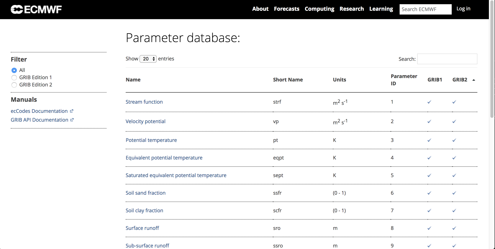

## ecCodes 命令行工具

### 简介

ecCodes 工具是一系列命令行程序的集合，用于 GRIB 数据的交互处理和批处理。
为大部分通用的 GRIB 数据操作提供方便且经过测试的解决方案。

使用这些工具可以节省编写新代码的时间，从而提高效率。

> 考虑使用 ecCodes 工具替代自己编写的程序。

这些工具提供通用的选项集，可以很方便地将同样的参数应用到不同的工具上。

> 建议尽可能使用命令行工具。

### 通用 ecCodes 工具

获取 ecCodes 安装信息：

```
codes_info
```

命令输出如下

统计 GRIB 和 BUFR 消息：

```
codes_count
```

命令输出结果：

```
$ codes_count gmf.gra.2018010300000.grb2 
761
```

## GRIB 工具简介

所有的工具使用通用的语法

```
grib_<tool> [options] grib_file [grib_file] ... [output_grib]
```

提供如下的工具：

- 统计 GRIB 文件中的消息数
    - grib_count
- 查看 GRIB 文件内容和比较 GRIB 文件内容
    - grib_ls
    - grib_dump
    - grib_get
    - grib_get_data
    - grib_compare
- 拷贝消息
    - grib_copy
- 修改 GRIB 消息内容
    - grib_set
    - grib_filter
- 将 GRIB 文件转码为 netCDF 格式
    - grib_to_netcdf

## 获取帮助信息

### 工具的帮助信息

每个工具都提供 UNIX man 风格的帮助信息，通过运行不带任务参数和输入文件的命令显示。

例如 grib_dump 的帮助信息如下：

```
NAME 	grib_dump

DESCRIPTION
	Dump the content of a grib file in different formats.

USAGE 
	grib_dump [options] grib_file grib_file ...

OPTIONS
	-O 	Octet mode. WMO documentation style dump.
	-D 	Debug mode.
	-d 	Print all data values.
	-j 	JSON mode (JavaScript Object Notation).
...
```

### ecCodes 文档

ecCodes 手册：

[https://software.ecmwf.int/wiki/display/ECC/ecCodes+Home](https://software.ecmwf.int/wiki/display/ECC/ecCodes+Home)

GRIB 工具文档：

[https://software.ecmwf.int/wiki/display/ECC/GRIB+tools](https://software.ecmwf.int/wiki/display/ECC/GRIB+tools)

包括如何使用工具的例子。

ecCodes 软件下载地址：

[https://software.ecmwf.int/wiki/display/ECC/Releases](https://software.ecmwf.int/wiki/display/ECC/Releases)


### ecCodes keys 和 GRIB 参数

GRIB 中的参数

- GRIB 参数数据库：[http://apps.ecmwf.int/codes/grib/param-db](http://apps.ecmwf.int/codes/grib/param-db)

GRIB keys

- GRIB 版本1：[http://apps.ecmwf.int/codes/grib/format/grib1/](http://apps.ecmwf.int/codes/grib/format/grib1/)
- GRIB 版本2：[http://apps.ecmwf.int/codes/grib/format/grib2/](http://apps.ecmwf.int/codes/grib/format/grib2/)
- GRIB 版本无关：[http://apps.ecmwf.int/codes/grib/format/edition-independent/](http://apps.ecmwf.int/codes/grib/format/edition-independent/)

免责声明：

包含上述相关信息的官方 FM-92 GRIB 文档可以从 WMO 的官方网站获取：

[http://www.wmo.int/pages/prog/www/WMOCodes.html](http://www.wmo.int/pages/prog/www/WMOCodes.html)

#### GRIB keys

查看版本无关、GRIB 1 和 GRIB 2 的 keys，请访问：

[http://apps.ecmwf.int/codes/grib/](http://apps.ecmwf.int/codes/grib/)

请优先使用版本无关的key。


#### 参数数据库

参数数据库保存 ecCodes 可以识别的所有参数的 GRIB 版本1和版本2的信息，以及部分参数的 NetCDF 编码信息。

数据库可以通过以下网址访问：

[http://apps.ecmwf.int/codes/grib/param-db](http://apps.ecmwf.int/codes/grib/param-db)


