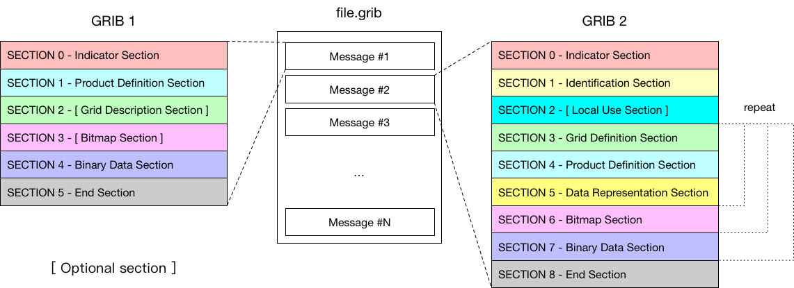

## GRIB 格式

见第一章的介绍。



### GRIB 1 消息

```
#==============   MESSAGE 1 ( length=130404 )              ==============
1-4       identifier = GRIB
5-7       totalLength = 130404
8         editionNumber = 1
======================   SECTION_1 ( length=28, padding=0 )    ======================
1-3       section1Length = 28
4         table2Version = 2
5         centre = 38 [Beijing  (RSMC)  (common/c-1.table) ]
6         generatingProcessIdentifier = 15
7         gridDefinition = 255
8         section1Flags = 128 [10000000]
9         indicatorOfParameter = 11 [T Temperature K (grib1/2.0.2.table) ]
10        indicatorOfTypeOfLevel = 100 [Isobaric level pressure in hectoPascals  (hPa)  (grib1/3.table) ]
11-12     level = 1000
13        yearOfCentury = 18
14        month = 1
15        day = 13
16        hour = 0
17        minute = 0
18        unitOfTimeRange = 1 [Hour (grib1/4.table) ]
19        P1 = 0
20        P2 = 0
21        timeRangeIndicator = 0 [Forecast product valid at reference time + P1  (P1>0)  (grib1/5.table) ]
22-23     numberIncludedInAverage = 0
24        numberMissingFromAveragesOrAccumulations = 0
25        centuryOfReferenceTimeOfData = 21
26        subCentre = 0 [Unknown code table entry () ]
27-28     decimalScaleFactor = 0
======================   SECTION_2 ( length=32, padding=0 )    ======================
1-3       section2Length = 32
4         numberOfVerticalCoordinateValues = 0
5         pvlLocation = 255
6         dataRepresentationType = 0 [Latitude/Longitude Grid (grib1/6.table) ]
7-8       Ni = 360
9-10      Nj = 181
11-13     latitudeOfFirstGridPoint = 90000
14-16     longitudeOfFirstGridPoint = 0
17        resolutionAndComponentFlags = 128 [10000000]
18-20     latitudeOfLastGridPoint = -90000
21-23     longitudeOfLastGridPoint = 359000
24-25     iDirectionIncrement = 1000
26-27     jDirectionIncrement = 1000
28        scanningMode = 0 [00000000]
29-32     zero =
======================   SECTION_4 ( length=130332, padding=0 )   ======================
1-3       section4Length = 130332
4         dataFlag = 8 [00001000]
5-6       binaryScaleFactor = -9
7-10      referenceValue = 223.079
11        bitsPerValue = 16
12-130332 values = (65160,130321) {
2.4710023499e+02, 2.4710023499e+02, 2.4710023499e+02, 2.4710023499e+02, 2.4710023499e+02, 2.4710023499e+02, 2.4710023499e+02, 2.4710023499e+02,
...
} # data_g1simple_packing values
======================   SECTION_5 ( length=4, padding=0 )     ======================
1-4       7777 = 7777
```

### GRIB 2 消息

```
#==============   MESSAGE 1 ( length=156935 )              ==============
1-4       identifier = GRIB
5-6       reserved = MISSING
7         discipline = 0 [Meteorological products (grib2/tables/4/0.0.table) ]
8         editionNumber = 2
9-16      totalLength = 156935
======================   SECTION_1 ( length=21, padding=0 )    ======================
1-4       section1Length = 21
5         numberOfSection = 1
6-7       centre = 38 [Beijing  (RSMC)  (common/c-11.table) ]
8-9       subCentre = 0
10        tablesVersion = 4 [Version implemented on 7 November 2007 (grib2/tables/1.0.table) ]
11        localTablesVersion = 0 [Local tables not used  (grib2/tables/4/1.1.table) ]
12        significanceOfReferenceTime = 0 [Analysis (grib2/tables/4/1.2.table) ]
13-14     year = 2018
15        month = 1
16        day = 13
17        hour = 0
18        minute = 0
19        second = 0
20        productionStatusOfProcessedData = 0 [Operational products (grib2/tables/4/1.3.table) ]
21        typeOfProcessedData = 0 [Analysis products (grib2/tables/4/1.4.table) ]
======================   SECTION_3 ( length=72, padding=0 )    ======================
1-4       section3Length = 72
5         numberOfSection = 3
6         sourceOfGridDefinition = 0 [Specified in Code table 3.1 (grib2/tables/4/3.0.table) ]
7-10      numberOfDataPoints = 205761
11        numberOfOctectsForNumberOfPoints = 0
12        interpretationOfNumberOfPoints = 0 [There is no appended list (grib2/tables/4/3.11.table) ]
13-14     gridDefinitionTemplateNumber = 0 [Latitude/longitude  (Also called equidistant cylindrical, or Plate Carree)  (grib2/tables/4/3.1.table) ]
15        shapeOfTheEarth = 6 [Earth assumed spherical with radius of 6,371,229.0 m (grib2/tables/4/3.2.table) ]
16        scaleFactorOfRadiusOfSphericalEarth = 0
17-20     scaledValueOfRadiusOfSphericalEarth = 0
21        scaleFactorOfEarthMajorAxis = 0
22-25     scaledValueOfEarthMajorAxis = 0
26        scaleFactorOfEarthMinorAxis = 0
27-30     scaledValueOfEarthMinorAxis = 0
31-34     Ni = 641
35-38     Nj = 321
39-42     basicAngleOfTheInitialProductionDomain = 0
43-46     subdivisionsOfBasicAngle = 0
47-50     latitudeOfFirstGridPoint = 90000000
51-54     longitudeOfFirstGridPoint = 0
55        resolutionAndComponentFlags = 48 [00110000]
56-59     latitudeOfLastGridPoint = 0
60-63     longitudeOfLastGridPoint = 180000000
64-67     iDirectionIncrement = 281250
68-71     jDirectionIncrement = 281250
72        scanningMode = 0 [00000000]
======================   SECTION_4 ( length=34, padding=0 )    ======================
1-4       section4Length = 34
5         numberOfSection = 4
6-7       NV = 0
8-9       productDefinitionTemplateNumber = 0 [Analysis or forecast at a horizontal level or in a horizontal layer at a point in time (grib2/tables/4/4.0.table) ]
10        parameterCategory = 0 [Temperature (grib2/tables/4/4.1.0.table) ]
11        parameterNumber = 0 [Temperature  (K)  (grib2/tables/4/4.2.0.0.table) ]
12        typeOfGeneratingProcess = 0 [Analysis (grib2/tables/4/4.3.table) ]
13        backgroundProcess = 0
14        generatingProcessIdentifier = 15
15-16     hoursAfterDataCutoff = 0
17        minutesAfterDataCutoff = 0
18        indicatorOfUnitOfTimeRange = 1 [Hour (grib2/tables/4/4.4.table) ]
19-22     forecastTime = 0
23        typeOfFirstFixedSurface = 100 [Isobaric surface  (Pa)  (grib2/tables/4/4.5.table) ]
24        scaleFactorOfFirstFixedSurface = 0
25-28     scaledValueOfFirstFixedSurface = 100000
29        typeOfSecondFixedSurface = 255 [Missing (grib2/tables/4/4.5.table) ]
30        scaleFactorOfSecondFixedSurface = MISSING
31-34     scaledValueOfSecondFixedSurface = MISSING
======================   SECTION_5 ( length=23, padding=0 )    ======================
1-4       section5Length = 23
5         numberOfSection = 5
6-9       numberOfValues = 205761
10-11     dataRepresentationTemplateNumber = 40 [JPEG2000 Packing (grib2/tables/4/5.0.table) ]
12-15     referenceValue = 22305.5
16-17     binaryScaleFactor = 0
18-19     decimalScaleFactor = 2
20        bitsPerValue = 14
21        typeOfOriginalFieldValues = 0 [Floating point (grib2/tables/4/5.1.table) ]
22        typeOfCompressionUsed = 0 [Lossless (grib2/tables/4/5.40.table) ]
23        targetCompressionRatio = 255
======================   SECTION_6 ( length=6, padding=0 )     ======================
1-4       section6Length = 6
5         numberOfSection = 6
6         bitMapIndicator = 255 [A bit map does not apply to this product (grib2/tables/4/6.0.table) ]
======================   SECTION_7 ( length=156759, padding=0 )   ======================
1-4       section7Length = 156759
5         numberOfSection = 7
6-156759  codedValues = (205761,156754) {
2.4710527344e+02, 2.4710527344e+02, 2.4710527344e+02, 2.4710527344e+02, 2.4710527344e+02, 2.4710527344e+02, 2.4710527344e+02, 2.4710527344e+02,
...
} # data_jpeg2000_packing codedValues
======================   SECTION_8 ( length=4, padding=0 )     ======================
1-4       7777 = 7777
```

## ecCodes 方式

ecCodes 使用 key/value 方式访问 GRIB 消息中的信息。

- `numberOfPointsAlongAParallel` -> 沿赤道的格点个数
- `numberOfPointsAlongAMeridan` -> 沿子午线的格点个数

每个 key 都有原生类型（real，integer，string）。
当从一个类型到其他类型的转换可行时，ecCodes 提供这种转换。

不同消息之间可用的 key 集合与下面的因素有关：

- GRIB 版本号
- 消息的内容

修改某个 key 可能导致某些其它 key 可用或不可用。

key 值并不总是编码在 GRIB 消息中，因为某些 key 是其它几个 key 通过指定的算法计算得到的，或者只是临时结果（短暂的）。
因此有如下两种类型的 key：

- **CODED** keys （编码在消息中的 key）
- **COMPUTED** keys （临时或从其它 key 计算得到）

某些 key 可以使用别名。

- `numberOfPointsAlongAParallel` -> `Ni` 或 `Nx` 或 `numberOfColumns`
- `numberOfPointsAlongAMeridan` -> `Nj` 或 `Ny` 或 `numberOfRows`

## GRIB key 和 parameter 的参考

GRIB Parameter Database，GRIB 参数数据库

[http://apps.ecmwf.int/codes/grib/param-db](http://apps.ecmwf.int/codes/grib/param-db)

GRIB keys

- [http://apps.ecmwf.int/codes/grib/format/grib1/](http://apps.ecmwf.int/codes/grib/format/grib1/)
- [http://apps.ecmwf.int/codes/grib/format/grib2/](http://apps.ecmwf.int/codes/grib/format/grib2/)
- [http://apps.ecmwf.int/codes/grib/format/edition-independent/](http://apps.ecmwf.int/codes/grib/format/edition-independent/)


免责声明：官方 FM-92 GRIB 文档由 WMO 负责维护，请访问如下网址获取公开的文档。

[http://www.wmo.int/pages/prog/www/WMOCodes.html](http://www.wmo.int/pages/prog/www/WMOCodes.html)

## GRIB 工具与 ecCodes keys

GRIB 工具是查看 GRIB 文件和查找 key 的最简便方式：

- `grib_ls` 获取文件内容的简要信息
- `grib_dump` 获取更详细的信息

在做些练习之后，就会对下面的描述有更清晰的认识。

## Namespace

命名空间是一系列 key 的集合的名称。

命名空间中的某个 key 可以通过在 key 前面加上命名空间前缀而获取/设置，或者更简单地不使用任何前缀。

- `time.step` == `step`
- `parameter.paramId` == `paramId`

有多个命名空间可以使用，例如：

- parameter
- time
- geography
- vertical
- statistics

## key 介绍

下面介绍一些有代表性的 key。

### 与文件相关

key 名称 | 描述
---|---
count | 文件中的消息序号
countTotal | 一组文件中的消息序号
offset | 消息在文件中的起始字节数

### 数据值

key 名称 | 描述
---|---
values | 包括数据值和缺失值的所有数据的数组
numberOfCodedValues | 数据段中的数据个数（包括缺失值）
numberOfPoints | 格点数或数据数组的大小
numberOfMissing | 缺失值个数
max, min, average... | 要素场的统计信息
... | ...

### 参数

不同版本间的参数定义有很大的区别。

GRIB 1 keys | GRIB 2 keys
-----|------
centre | discipline
table2Version | parameterCategory
indicatorOfParameter | parameterNumber
levelType | typeOfFirstFixedSurface
level | scaleFactorOfFirstFixedSurface
... | scaledValueOfFirstFixedSurface
... | typeOfSecondFixedSurface
... | scaleFactorOfSecondFixedSurface
... | scaledValueOfSecondFixedSurface
... | productDefinitionTemplateNumber
... | ...

ecCodes 提供一些与版本无关的 key，用于定义参数。

key 名称 | 示例值
------|------
paramId | 151
shortName | msl
centre | ecmf(or 98)
name | Mean sea level pressure
unit | Pa

这些值定义在 `parameter` 命名空间中。

### 时间

预报运行起始时间 | 示例值
------|------
dataDate | 20160224(YYYYMMDD)
dataTime | 0, 600, 1200, 1800

预报时效 | 示例值
------|-------
stepType | instant, accum, avg, max, min, …
stepUnits | s, m, h, 3h, 6h, 12h, D, M, Y, 10Y, 30Y, C
startStep | 0, 3, …
endStep(= step) | 0, 3, ..
stepRange | 3-6, 6 (“startStep-endStep” ,“endStep” )

Validity of the forecast | 示例值
------------|----------------
validityDate | 20160224(YYYYMMDD)
validityTime | 0, 300, 1200, 1800

### 垂直层次和地理信息

vertical 命名空间 | 示例值
-------------|----------
typeOfLevel | hybrid, surface, depthBelowLandLayer,isobaricInhPa,…
level | 0, 1, 137, 1000, 850, …

geography 命名空间 | 示例值
-------------|-----------
Ni (Nx) | 720
Nj(Ny) | 361
gridType | reduced_gg, regular_ll, sh, …
latitudeOfFirstGridPointInDegrees | 90.0,55.5, …
longitudeOfFirstGridPointInDegrees | 0.0,350.0, …
latitudeOfLastGridPointInDegrees | -90.0,35.0, …
longitudeOfLastGridPointInDegrees | 360.0,50.0, …
iDirectionIncrementInDegrees | 0.5, …
jDirectionIncrementInDegrees | 0.5, …
N | 640, 320, …
… | …

### 地理数组

**latitudes（纬度），longitudes（经度）**

保存网格中每个点的所有经纬度值的数组

**latLonValues**

保存网格中每个点的所有经纬度和数据值的数组

```
(lat1,lon1,value1,lat2,lon2,value2,…,latN,lonN,valueN)
```

## gridTypes

版本 1 和 版本 2 均可以使用的网格种类：

– regular_ll
– reduced_ll
– mercator
– lambert
– polar_stereographic
– UTM
– simple_polyconic
– albers
– miller
– rotated_ll
– stretched_ll
– stretched_rotated_ll
– regular_gg
– rotated_gg
– stretched_gg
– stretched_rotated_gg
– reduced_gg
– sh
– rotated_sh
– stretched_sh
– stretched_rotated_sh
– space_view

仅版本 2 可以使用的类型：

– triangular_grid
– equatorial_azimuthal_equidistant
– azimuth_range
– cross_section
– Hovmoller
– time_section
– lambert_azimuthal_equal_area

对于下面的网格类型，使用 `grib_get_data` 工具和 C/F90/Python 接口 `grib_iterator` 可以获取网格点的经纬度值。

gridType | 说明
--------|-----
regular_ll | regular latitude-longitude
reduced_ll | reduced latitude-longitude
regular_gg | regular gaussian
lambert | lambert conformal
polar_stereographic | polar stereographic
space_view | space view perspective


### packingType

GRIB 版本 1 和 2 通用：

– grid_simple
– grid_simple_matrix
– grid_second_order
– spectral_complex
– spectral_simple

仅 GRIB 版本 2 使用：

– grid_simple_log_preprocessing
– grid_jpeg
– grid_png
– grid_ieee

### MARS

该命名空间包含所有的 MARS 关键词。

key 名称 | 示例值
------|--------
date | 20160224 (YYYYMMDD)
time | 0000,0600, 1200, 1800
step | 3,6, 9, 12, …
class | od, …
stream | oper, enfo,…
expver | 0001
type | an, fc, cf, pf, …
levtype | sfc, pl,ml
levelist | 500, 850, …
param | 151.128
