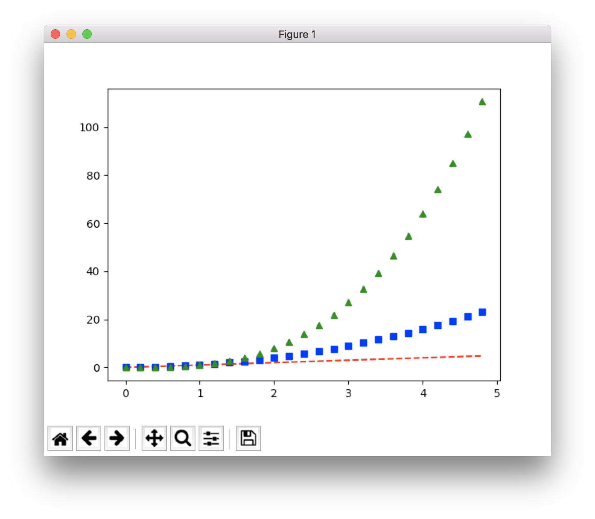
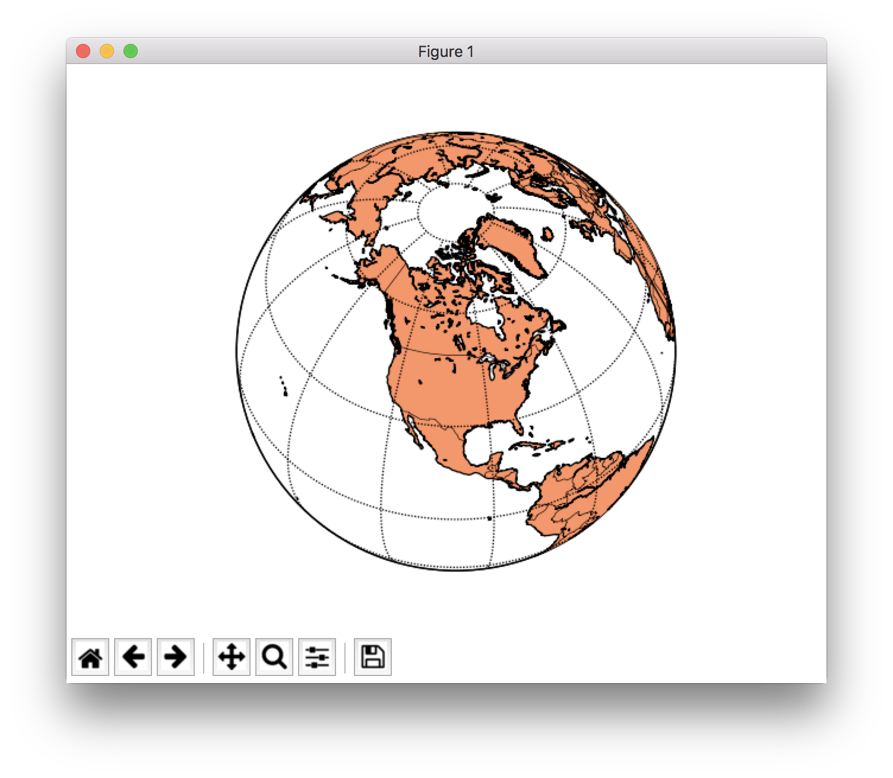

本章节仅是一个开胃菜，向用户展示 Python 接口提供的很小的一部分功能，用户可以自行探索各种功能。

## Python 是什么

## hello world

```py
#!/usr/bin/env python
import sys
# This is a comment
def say_hello(name):
    print(“Hello "+ name + "!" )
if len(sys.argv) > 1 : name = sys.argv[1]
else:
    name = “World"
say_hello(name)
```

加载需要的模块。

使用**缩进**定义不同的程序块。而不是 `;` 或 `{}` 或 `END`。

使用 `def` 定义函数。

动态变量类型。

处理字符串十分方便。

使用 `python` 运行，或定义 shebang 并配置权限后直接运行。

```
$> python example.py
hello World!
$> ./example.py Xavi
hello Xavi!
```

## 列表和字典（List and dict)

列表类似于 c 语言中的数组，但同一个列表中可以保存不同类型的数据。

```
$> python
>>> mylist = ['a','b','c'] >>> print(mylist)
['a', 'b', 'c']
>>> mylist[2:]
['c']
>>> mylist[-1]
'c'
>>> for element in mylist: ... print(element) ...
a
b
c
```

字典相当于 c++ 中的 `std::map`，可以保存不同种类的数据。

```py
>>> mydict = {'key1':1,'key2':2,'key3':3} >>> for key,value in mydict.items():
... print(key + ":" + str(value)) ...
key3:3
key2:2
key1:1
>>> 'key1' in mydict
True
>>> 'key5' in mydict
False
>>> len(mydict)
3
>>> mydict.keys() ['key3', 'key2', 'key1'] >>> mydict.values()
[3, 2, 1]
```

## NumPy

NumPy 是 Python 科学计算的基础包。提供对多维数组的支持。
同时提供大量对数据进行快速操作的函数，性能与 C 和 Fortran 相当。

越来越多基于 Python 的数据和科学库使用 NumPy。

NumPy 的核心是 ndarray 对象，一个 n 维同构数组。

```py
>>> from numpyimport *
>>> a = arange(15).reshape(3, 5)
>>> a
array([[ 0, 1, 2, 3, 4],
[ 5, 6, 7, 8, 9],
[10, 11, 12, 13, 14]])
>>> a.shape
(3, 5)
>>> a.ndim
2
>>> a.size
15
>>> b = array([6, 7, 8])
>>> b
array([6, 7, 8])
>>> a.sum()
105
>>> a.min()
0
>>> a.max()
14
>>> a.mean()
7.0
>>> b*2
array([12, 14, 16])
>>> b-b
array([0, 0, 0])
>>> b*b
array([36, 49, 64])
```

> 了解NumPy提供哪些函数非常困难。

[http://docs.scipy.org/doc/numpy/reference/](http://docs.scipy.org/doc/numpy/reference/)

数据的操作包括：

- 数学和逻辑
- 变形
- 选择
- IO
- 离散傅里叶变换
- 基本线性代数
- 基本统计函数
- 随机模拟

## matplotlib

Python 和 NumPy 扩展的绘图库。

原生模拟 Matlib 的绘图命令，但独立实现。

重度依赖 NumPy。

设计哲学：

- 创建图形应该很简单
- 图形应该漂亮
- 使用尽可能少的语句创建图形
- 代码应该容易理解
- 应该很容易扩展代码

支持 2 维和 3 维图形。

底图模块：projections，coastlines，political boundaries

```py
import numpy as np
import matplotlib
# or use
# echo "backend: TkAgg" >> ~/.matplotlib/matplotlibrc
matplotlib.use("TkAgg")

import matplotlib.pyplot as plt

# evenly sampled time at 200ms intervals
t = np.arange(0., 5., 0.2)

# red dashes, blue squares and green triangles
plt.plot(t, t, 'r--', t, t**2, 'bs', t, t**3, 'g^')

plt.show()
```

绘制结果如图所示



```py
import numpy as np
import matplotlib
# or use
# echo "backend: TkAgg" >> ~/.matplotlib/matplotlibrc
matplotlib.use("TkAgg")


from mpl_toolkits.basemap import Basemap
import matplotlib.pyplot as plt
# make sure the value of resolution is a lowercase L,
#  for 'low', not a numeral 1
map = Basemap(projection='ortho', lat_0=50, lon_0=-100,
              resolution='l', area_thresh=1000.0)
map.drawcoastlines()
map.drawcountries()
map.fillcontinents(color='coral')
map.drawmapboundary()
map.drawmeridians(np.arange(0, 360, 30))
map.drawparallels(np.arange(-90, 90, 30))

plt.show()
```




## SciPy 库

科学算法和数学工具的开源库，依赖 NumPy。提供 NumPy 很多函数的增强版本。

因为计算由 C 扩展模块实现，所以速度非常快。

提供一套精心挑选的高层科学和工程模块：

- 统计
- 优化
- 数值拟合
- 线性代数
- 傅里叶变换
- 信号处理
- 图像处理
- 常微分方程求解器
- 特殊函数

## Ipython - Jupyter

交互的增强型 python 控制台

服务器/客户端网页 Notebooks。

## SciPy 软件栈

基于 Python 的开源软件生态系统，用于数学、科学和工程。

依赖下面的 Python 库：

- **NumPy**：基本 N 维数组包
- **SciPy Library**：基础科学计算库
- **Matplotlib**：综合二维绘图
- **Ipython / Jupyter**：增强交互Python控制台，notebooks
- **Sympy**：符号数学
- **Pandas**：数据结构和分析

## Python 在 ECMWF 的使用

目前有两个 ECMWF 的库有 Python 接口：

- ecCodes / GRIB API
- Magics++

ecCharts

新的网页图形（ecCodes，magics++）

检验（ecCodes，magics++)

EcFlow（SMS 的替代品）：服务器配置和客户端通讯

Copernicus 项目（ecCodes）

EFAS（European Fload Alert System）（EcFlow）

科研

计划开发下一代插值库的 Python 接口。

## Magics++

ECMWF 开发的气象绘图软件，已在 ECMWF 和成员国使用超过 25 年。

支持等值线、风场、观测、卫星图像、符号、文字、坐标轴和图像的绘制。

两种绘制方式：

- 可以直接绘制的数据类型：GRIB1、GRIB2、BUFR、ODB、NetCDF 和 NumPy
- 可以使用 ecCodes 读取的数据场，可以修改后传递给 magics++ 绘制。

生成的气象图形可以保存成多种格式，例如 PS，EPS，PDF，GIF，PNG，KML 和 SVG。

提供过程式接口和高层 Python 编程接口。
