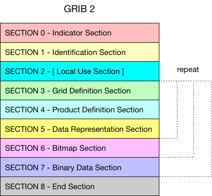
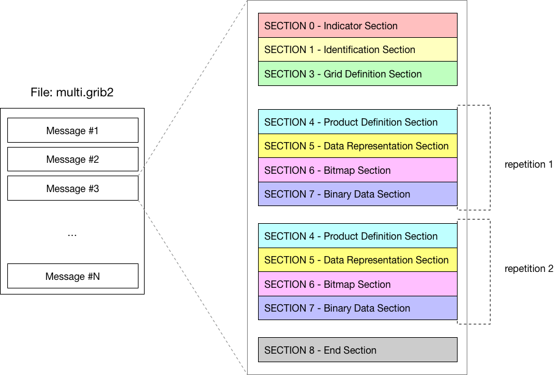

GRIB 2 的消息中第2段到第7段都可以重复，见下图。

> 译者注：NWPC 的 GRIB 2 数据尚未使用该功能，下面示例只是教程中的文字，尚未实际验证。



一个示例文件如下图所示：



## 示例

考虑 数值预报模式预报的 12 小时和 24小时的 500 hPa 高度场。

```
Section 0: Indicator Section
Section 1: Identification Section 
Section 2: Local Use Section (optional) 
Section 3: Grid Definition Section

Section 4: Product Definition Section       (hour = 12) | repetition 1
Section 5: Data Representation Section                  |
Section 6: Bit-Map Section                              |
Section 7: Data Section                                 |

Section 4: Product Definition Section       (hour = 24) | repetition 2
Section 5: Data Representation Section                  |
Section 6: Bit-Map Section                              |
Section 7: Data Section                                 |

Section 8: End Section
```

注意：网格定义段（Grid Definition Section）未重复，对所有的预报时效都有效。

## 练习

创建一个多要素场的 GRIB 2 文件。

```cpp
#include <iostream>
#include <eccodes.h>

using namespace std;

int main(int argc, char** argv)
{
    if(argc < 2)
    {
        cout<<"Usage: "<<argv[0]<<" grib_file_path";
        return 1;
    }

    const char* file_path = argv[1];

    const char* sample_filename = "regular_ll_pl_grib2";
    int err = 0;
    codes_handle *h = codes_grib_handle_new_from_samples(nullptr,  sample_filename);
    if(h == nullptr)
    {
        cout<<"ERROR: unable to create handle from file "<<file_path<<endl;
        return 1;
    }

    size_t value_size;
    codes_get_size(h, "values", &value_size);

    auto values = new double[value_size];
    double v = 0;
    for(auto i=0; i<value_size; i++)
    {
        values[i] = v;
        v++;
    }
    // codes_set_long(h, "bitsPerValue", 16);
    codes_set_double_array(h, "values", values, value_size);

    codes_multi_handle* multi_handle = codes_grib_multi_handle_new(nullptr);

    const int start_section = 4;

    for (int step = 12; step <= 120; step += 12)
    {
        codes_set_long(h, "step", step);

        codes_grib_multi_handle_append(h, start_section, multi_handle);
    }


    FILE* output_file=fopen(file_path, "wb");
    if(!output_file)
    {
        cerr<<"ERROR: unable to open output file " << file_path <<endl;
        exit(1);
    }

    codes_grib_multi_handle_write(multi_handle, output_file);
    fclose(output_file);

    delete [] values;
    codes_handle_delete(h);
    codes_grib_multi_handle_delete(multi_handle);

    return 0;
}
```

使用 `grib_ls` 查看生成的文件，ecCodes 将多变量消息处理成多个单变量消息。

```
$ grib_ls multi.grib2 
multi.grib2
edition      centre       date         dataType     gridType     stepRange    typeOfLevel  level        shortName    packingType  
2            ecmf         20070323     af           regular_ll   12           isobaricInhPa  850          t            grid_simple 
2            ecmf         20070323     af           regular_ll   24           isobaricInhPa  850          t            grid_simple 
2            ecmf         20070323     af           regular_ll   36           isobaricInhPa  850          t            grid_simple 
2            ecmf         20070323     af           regular_ll   48           isobaricInhPa  850          t            grid_simple 
2            ecmf         20070323     af           regular_ll   60           isobaricInhPa  850          t            grid_simple 
2            ecmf         20070323     af           regular_ll   72           isobaricInhPa  850          t            grid_simple 
2            ecmf         20070323     af           regular_ll   84           isobaricInhPa  850          t            grid_simple 
2            ecmf         20070323     af           regular_ll   96           isobaricInhPa  850          t            grid_simple 
2            ecmf         20070323     af           regular_ll   108          isobaricInhPa  850          t            grid_simple 
2            ecmf         20070323     af           regular_ll   120          isobaricInhPa  850          t            grid_simple 
10 of 10 messages in multi.grib2

10 of 10 total messages in 1 files
```
