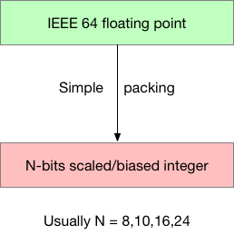
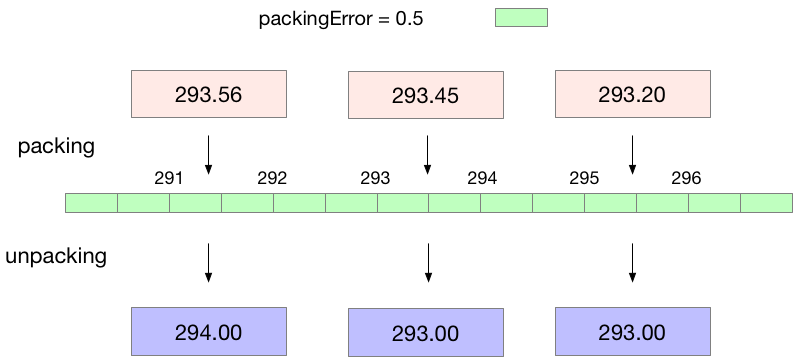
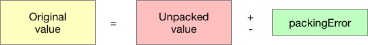

`Simple Pakcking` 会丢失信息。

## keys

基本 key：

- `values`
- `decimalPrecision`
- `changeDecimalPrecision`
- `packingError` (read only)

仅在明白打包原理的情况下使用下面的 key：

- `referenceValue` (read only)
- `bitsPerValue`
- `decimalScaleFactor`
- `binaryScaleFactor` (read only)

注意：设置 `decimalPrecision` 不会重新打包数据，但设置 `changeDecimalPrecision` 会导致数据重新打包。

## simple packing = 离散化

下面的图示说明 simple packing 的原理。

simple packing 的数据值满足下面的公式：

packing error 依赖 packing 参数：

- `bitsPerValue`
- `decimalScaleFactor`
- `binaryScaleFactor`
- `referenceValue`

### Decimal precision

小数精度 = 要保留的小数位数，例如：

`decimalPrecision = 0` -> `packingError = 0.5`

`decimalPrecision = 1` -> `packingError = 0.05`

`decimalPrecision = 2` -> `packingError = 0.005`

## 示例

> 译者注：尚未理解 simple packing，后续会补充示例。
