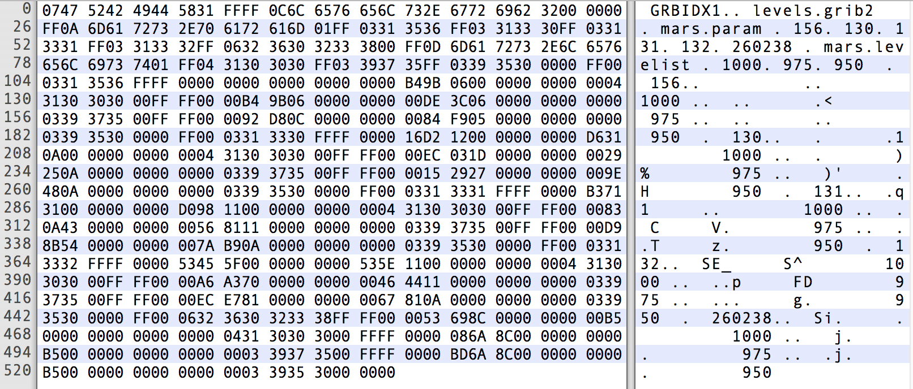

# ecCodes 索引访问

先介绍与索引访问有关的几个函数。

- 创建文件内容的索引

```cpp
codes_index* codes_index_new_from_file(codes_context* c, char* filename,const char* keys,int *err);
```

- 从索引中获取某个 key 的维度

```cpp
int codes_index_get_size(codes_index* index,const char* key,size_t* size);
```

- 从索引中获取 key 的不同“值”

```cpp
int codes_index_get_long(codes_index* index,const char* key,long* values,size_t *size);
int codes_index_get_double(codes_index* index,const char* key, double* values,size_t *size);
int codes_index_get_string(codes_index* index,const char* key,char** values,size_t *size);
```

- 从索引中为某个 key 选择一个“值”

```cpp
int codes_index_select_long(codes_index* index,const char* key,long value);
int codes_index_select_double(codes_index* index,const char* key,double value);
int codes_index_select_string(codes_index* index,const char* key,char* value);
```

- 加载与选择模型对应的 GRIB 消息

```cpp
codes_handle* codes_handle_new_from_index(codes_index* index,int *err);
```

- 释放索引

```cpp
void codes_index_delete(codes_index* index);
```

- 释放 GRIB 消息

```cpp
int codes_handle_delete(codes_handle* h);
```

对于“随机访问”来说，使用索引访问通常比顺序访问更快。

## 示例：索引访问

```cpp
#include <iostream>
#include <eccodes.h>
susing namespace std;

int main(int argc, char** argv)
{
    if(argc < 2)
    {
        cout<<"Usage: "<<argv[0]<<" grib_file_path";
        return 1;
    }

    const char* file_path = argv[1];

    int err = 0;

    codes_index* index = nullptr;
    index = codes_index_new(nullptr, "paramId", &err);
    if (err)
    {
        cout<<"error: "<<codes_get_error_message(err)<<endl;
        exit(err);
    }

    err = codes_index_add_file(index, file_path);

    if (err)
    {
        cout<<"error: " << codes_get_error_message(err)<<endl;
        exit(err);
    }
    cout<<"end indexing..."<<endl;

    size_t param_id_size;
    codes_index_get_size(index,"paramId", &param_id_size);

    auto param_id_array= new long[param_id_size];
    codes_index_get_long(index, "paramId", param_id_array, &param_id_size);

    for(int i=0; i < param_id_size; i++)
    {
        auto param_id = param_id_array[i];
        codes_index_select_long(index, "paramId", param_id);

        codes_handle* h = nullptr;
        int count = 0;
        while ((h = codes_handle_new_from_index(index, &err)) != nullptr)
        {
            count++;
            if (err)
            {
                printf("error: %d\n",err);
                exit(err);
            }

            size_t short_name_length;
            codes_get_length(h, "shortName", &short_name_length);
            auto short_name = new char[short_name_length];
            codes_get_string(h, "shortName", short_name, &short_name_length);

            long level;
            codes_get_long(h,"level",&level);

            long number;
            codes_get_long(h,"number",&number);

            long step;
            codes_get_long(h,"step",&step);

            printf("shortName=%s ",short_name);
            printf("level=%ld ",level);
            printf("number=%ld ",number);
            printf("step=%ld \n",step);
            codes_handle_delete(h);
            delete [] short_name;
        }
    }

    codes_index_delete(index);

    return 0;
}
```

## 输入/输出

索引可以保存到文件中，方便重复使用。

- 保存索引到文件

```cpp
int codes_index_write(codes_index *index, const char *filename);
```

- 加载使用 `codes_index_write` 创建的索引文件

```cpp
codes_index* codes_index_read(codes_context* c,const char* filename,int *err);
```

正如前一节的示例所展示的，我们可以将数据文件的内容添加到索引中。

```cpp
int codes_index_add_file(grib_index *index, const char *filename);
```

可以使用 ecCodes 命令行工具 `grib_index_build` 创建索引文件。

```
$ grib_index_build -o cli.index levels.grib2 
--- grib_index_build: processing levels.grib2
--- grib_index_build: keys included in the index file cli.index:
--- mars.param, mars.levelist
--- mars.param = { 156, 130, 131, 132, 260238 }
--- mars.levelist = { 1000, 975, 950 }
--- 15 messages indexed
```

创建的索引文件是二进制文件。



使用 `grib_dump -D <index_file>` 查看索引文件的内容。

```
$ grib_dump -D cli.index
***** FILE: cli.index 
GRIB File: levels.grib2
Index keys:
key name = mars.param
values = 156, 130, 131, 132, 260238
key name = mars.levelist
values = 1000, 975, 950
Index count = 15
no messages found in cli.index
```

在练习章节中会介绍更详细的内容。