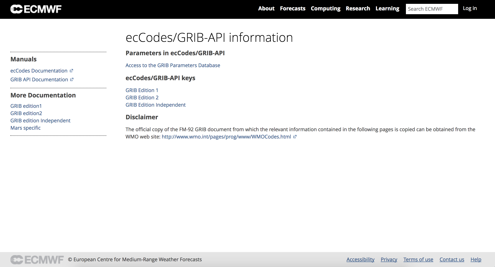

# GRIB 工具

## ecCodes 命令行工具

### 简介

ecCodes 工具是一系列命令行程序的集合，用于 GRIB 数据的交互处理和批处理。
为大部分通用的 GRIB 数据操作提供方便且经过测试的解决方案。

使用这些工具可以节省编写新代码的时间，从而提高效率。

> 考虑使用 ecCodes 工具替代自己编写的程序。

这些工具提供通用的选项集，可以很方便地将同样的参数应用到不同的工具上。

> 建议尽可能使用命令行工具。

### 通用 ecCodes 工具

获取 ecCodes 安装信息：

```
codes_info
```

命令输出如下

统计 GRIB 和 BUFR 消息：

```
codes_count
```

命令输出结果：

```
$ codes_count gmf.gra.2018010300000.grb2 
761
```

## GRIB 工具简介

所有的工具使用通用的语法

```
grib_<tool> [options] grib_file [grib_file] ... [output_grib]
```

提供如下的工具：

- 统计 GRIB 文件中的消息数
    - grib_count
- 查看 GRIB 文件内容和比较 GRIB 文件内容
    - grib_ls
    - grib_dump
    - grib_get
    - grib_get_data
    - grib_compare
- 拷贝消息
    - grib_copy
- 修改 GRIB 消息内容
    - grib_set
    - grib_filter
- 将 GRIB 文件转码为 netCDF 格式
    - grib_to_netcdf

## 获取帮助信息

### 工具的帮助信息

每个工具都提供 UNIX man 风格的帮助信息，通过运行不带任务参数和输入文件的命令显示。

例如 grib_dump 的帮助信息如下：

```
NAME 	grib_dump

DESCRIPTION
	Dump the content of a grib file in different formats.

USAGE 
	grib_dump [options] grib_file grib_file ...

OPTIONS
	-O 	Octet mode. WMO documentation style dump.
	-D 	Debug mode.
	-d 	Print all data values.
	-j 	JSON mode (JavaScript Object Notation).
...
```

### ecCodes 文档

ecCodes 手册：

[https://software.ecmwf.int/wiki/display/ECC/ecCodes+Home](https://software.ecmwf.int/wiki/display/ECC/ecCodes+Home)

GRIB 工具文档：

[https://software.ecmwf.int/wiki/display/ECC/GRIB+tools](https://software.ecmwf.int/wiki/display/ECC/GRIB+tools)

包括如何使用工具的例子。

ecCodes 软件下载地址：

[https://software.ecmwf.int/wiki/display/ECC/Releases](https://software.ecmwf.int/wiki/display/ECC/Releases)


### ecCodes keys 和 GRIB 参数

GRIB 中的参数

- GRIB 参数数据库：[http://apps.ecmwf.int/codes/grib/param-db](http://apps.ecmwf.int/codes/grib/param-db)

GRIB keys

- GRIB 版本1：[http://apps.ecmwf.int/codes/grib/format/grib1/](http://apps.ecmwf.int/codes/grib/format/grib1/)
- GRIB 版本2：[http://apps.ecmwf.int/codes/grib/format/grib2/](http://apps.ecmwf.int/codes/grib/format/grib2/)
- GRIB 版本无关：[http://apps.ecmwf.int/codes/grib/format/edition-independent/](http://apps.ecmwf.int/codes/grib/format/edition-independent/)

免责声明：

包含上述相关信息的官方 FM-92 GRIB 文档可以从 WMO 的官方网站获取：

[http://www.wmo.int/pages/prog/www/WMOCodes.html](http://www.wmo.int/pages/prog/www/WMOCodes.html)

#### GRIB keys

查看版本无关、GRIB 1 和 GRIB 2 的 keys，请访问：

[http://apps.ecmwf.int/codes/grib/](http://apps.ecmwf.int/codes/grib/)

请优先使用版本无关的key。



#### 参数数据库

参数数据库保存 ecCodes 可以识别的所有参数的 GRIB 版本1和版本2的信息，以及部分参数的 NetCDF 编码信息。

数据库可以通过以下网址访问：

[http://apps.ecmwf.int/codes/grib/param-db](http://apps.ecmwf.int/codes/grib/param-db)


## 信息工具

### codes_info

关于 ecCodes 的安装信息。

通用的 `codes_info` 工具提供 ecCodes 软件包使用的基本信息，包括：

- ecCodes 版本
- 定义文件的路径，`ECCODES_DEFINITION_PATH`
- 样例文件的路径，`ECCODES_SAMPLE_PATH`

命令输出如下：

```
$ ./codes_info

ecCodes Version 2.6.0

Default definition files path is used: /Users/wangdp/lib/nwpc/ecmwf/eccodes/install/share/eccodes/definitions
Definition files path can be changed setting ECCODES_DEFINITION_PATH environment variable

Default SAMPLES path is used: /Users/wangdp/lib/nwpc/ecmwf/eccodes/install/share/eccodes/samples
SAMPLES path can be changed setting ECCODES_SAMPLES_PATH environment variable
```

### grib_count

统计 GRIB 消息个数

快速统计文件列表中的 GRIB 消息个数。

语法如下（接受通配符）：

```
grib_count grib_file1 [gri_file2 ...]
```

## 查看工具

### grib_dump

显示 GRIB 文件内容

使用 `grib_dump` 显示包含一个或多个 GRIB 消息的文件内容。

支持不同的输出格式：

- Octet mode: 提供 WMO 风格的输出
- Debug mode: 打印 GRIB 文件中所有的 key
- Octet 和 Debug 两种模式不能同时使用
- Octet 内容可以使用十六进制格式输出。

通过设置选项，还可以输出 key aliases 和 key 的类型信息（key type information)。

支持 JSON 格式输出，便于处理。

#### 使用方法

```
grib_dump [options] grib_file grib_file ...
```

基本参数：

参数|含义
---|---
-O | Octet 模式（WMO 文档风格）
-D | Debug 模式
-a | 打印 key alias 信息
-t | 打印 key 类型信息
-H | 十六进制显示的 Octet 模式 
-w key[:{s|i|d}]{=|!=}value,... | where 子句
-j | JSON 输出
-V | 打印 ecCodes 版本

#### 示例

以中国气象局数值预报中心的 GRAPES GFS 输出的 GRIB 2 产品为例

```
$ grib_dump gmf.gra.2018010300000.grb2 
***** FILE: gmf.gra.2018010300000.grb2 
#==============   MESSAGE 1 ( length=356 )                 ==============
GRIB {
  # Meteorological products (grib2/tables/4/0.0.table)  
  discipline = 0;
  editionNumber = 2;
  # Beijing  (RSMC)  (common/c-11.table)  
  centre = 38;
  subCentre = 0;
  # Analysis (grib2/tables/4/1.2.table)  
  significanceOfReferenceTime = 0;
  dataDate = 20180103;
  dataTime = 0;
  # Operational products (grib2/tables/4/1.3.table)  
  productionStatusOfProcessedData = 0;
  # Analysis products (grib2/tables/4/1.4.table)  
  typeOfProcessedData = 0;
  numberOfDataPoints = 1036800;
  # There is no appended list (grib2/tables/4/3.11.table)  
  interpretationOfNumberOfPoints = 0;
  # Latitude/longitude  (Also called equidistant cylindrical, or Plate Carree)  (grib2/tables/4/3.1.table)  
  gridDefinitionTemplateNumber = 0;
  # Earth assumed spherical with radius of 6,371,229.0 m (grib2/tables/4/3.2.table)  
  shapeOfTheEarth = 6;
  Ni = 1440;
  Nj = 720;
  iScansNegatively = 0;
  jScansPositively = 0;
  jPointsAreConsecutive = 0;
  alternativeRowScanning = 0;
  latitudeOfFirstGridPointInDegrees = 89.875;
  longitudeOfFirstGridPointInDegrees = 0;
  latitudeOfLastGridPointInDegrees = -89.875;
  longitudeOfLastGridPointInDegrees = 359.75;
  iDirectionIncrementInDegrees = 0.25;
  jDirectionIncrementInDegrees = 0.25;
  gridType = regular_ll;
  NV = 0;
  # Average, accumulation, extreme values or other statistically processed values at a horizontal level or in a horizontal layer in a continuous or non-continuous time interval (grib2/tables/4/4.0.table)  
  productDefinitionTemplateNumber = 8;
  # Moisture (grib2/tables/4/4.1.0.table)  
  parameterCategory = 1;
  # Convective precipitation  (kg m-2)  (grib2/tables/4/4.2.0.1.table)  
  parameterNumber = 10;
  #-READ ONLY- parameterUnits = kg m-2;
  #-READ ONLY- parameterName = Convective precipitation ;
  # Analysis (grib2/tables/4/4.3.table)  
  typeOfGeneratingProcess = 0;
  generatingProcessIdentifier = 15;
  # Hour (grib2/tables/4/4.4.table)  
  indicatorOfUnitOfTimeRange = 1;
  # Hour (stepUnits.table)  
  stepUnits = 1;
  forecastTime = 0;
  # Ground or water surface  (grib2/tables/4/4.5.table)  
  typeOfFirstFixedSurface = 1;
  #-READ ONLY- unitsOfFirstFixedSurface = unknown;
  #-READ ONLY- nameOfFirstFixedSurface = Ground or water surface ;
  scaleFactorOfFirstFixedSurface = MISSING;
  scaledValueOfFirstFixedSurface = MISSING;
  # Missing (grib2/tables/4/4.5.table)  
  typeOfSecondFixedSurface = 255;
  #-READ ONLY- unitsOfSecondFixedSurface = unknown;
  #-READ ONLY- nameOfSecondFixedSurface = Missing;
  scaleFactorOfSecondFixedSurface = MISSING;
  scaledValueOfSecondFixedSurface = MISSING;
  level = 0;
  endStep = 0;
  stepRange = 0;
  shortNameECMF = acpcp;
  shortName = acpcp;
  nameECMF = Convective precipitation (water);
  name = Convective precipitation (water);
  cfNameECMF = lwe_thickness_of_convective_precipitation_amount;
  cfName = lwe_thickness_of_convective_precipitation_amount;
  cfVarNameECMF = acpcp;
  cfVarName = acpcp;
  #-READ ONLY- modelName = unknown;
  numberOfValues = 1036800;
  packingType = grid_jpeg;
  # A bit map does not apply to this product (grib2/tables/4/6.0.table)  
  bitMapIndicator = 255;
  bitmapPresent = 0;
  values(1036800) =  {
  0, 0, 0, 0, 0, 
  0, 0, 0, 0, 0, 
  0, 0, 0, 0, 0, 
  0, 0, 0, 0, 0, 
  0, 0, 0, 0, 0, 
  0, 0, 0, 0, 0, 
  0, 0, 0, 0, 0, 
  0, 0, 0, 0, 0, 
  0, 0, 0, 0, 0, 
  0, 0, 0, 0, 0, 
  0, 0, 0, 0, 0, 
  0, 0, 0, 0, 0, 
  0, 0, 0, 0, 0, 
  0, 0, 0, 0, 0, 
  0, 0, 0, 0, 0, 
  0, 0, 0, 0, 0, 
  0, 0, 0, 0, 0, 
  0, 0, 0, 0, 0, 
  0, 0, 0, 0, 0, 
  0, 0, 0, 0, 0
  ... 1036700 more values
  } 
  #-READ ONLY- maximum = 0;
  #-READ ONLY- minimum = 0;
  #-READ ONLY- average = 0;
  #-READ ONLY- numberOfMissing = 0;
  #-READ ONLY- standardDeviation = 0;
  #-READ ONLY- skewness = 0;
  #-READ ONLY- kurtosis = 0;
  #-READ ONLY- isConstant = 1;
  #-READ ONLY- getNumberOfValues = 1036800;
}
```

使用其他选项

```
$ grib_dump -OtaH gmf.gra.2018010300000.grb2 
***** FILE: gmf.gra.2018010300000.grb2 
#==============   MESSAGE 1 ( length=356 )                 ==============
1-4       ascii identifier = GRIB ( 0x47 0x52 0x49 0x42 )
5-6       unsigned reserved = MISSING ( 0xFF 0xFF )
7         codetable discipline = 0 ( 0x00 ) [Meteorological products (grib2/tables/4/0.0.table) ]
8         unsigned editionNumber = 2 ( 0x02 ) [ls.edition]
9-16      section_length totalLength = 356 ( 0x00 0x00 0x00 0x00 0x00 0x00 0x01 0x64 )
======================   SECTION_1 ( length=21, padding=0 )    ======================
1-4       section_length section1Length = 21 ( 0x00 0x00 0x00 0x15 )
5         unsigned numberOfSection = 1 ( 0x01 )
6-7       codetable centre = 38 ( 0x00 0x26 ) [Beijing  (RSMC)  (common/c-11.table) ] [identificationOfOriginatingGeneratingCentre, ls.centre, originatingCentre, centreForLocal]
8-9       unsigned subCentre = 0 ( 0x00 0x00 )
10        codetable tablesVersion = 4 ( 0x04 ) [Version implemented on 7 November 2007 (grib2/tables/1.0.table) ] [gribMasterTablesVersionNumber]
11        codetable localTablesVersion = 1 ( 0x01 ) [Unknown code table entry (grib2/tables/4/1.1.table) ] [versionNumberOfGribLocalTables]
12        codetable significanceOfReferenceTime = 0 ( 0x00 ) [Analysis (grib2/tables/4/1.2.table) ]
13-14     unsigned year = 2018 ( 0x07 0xE2 )
15        unsigned month = 1 ( 0x01 )
16        unsigned day = 3 ( 0x03 )
17        unsigned hour = 0 ( 0x00 )
18        unsigned minute = 0 ( 0x00 )
19        unsigned second = 0 ( 0x00 )
20        codetable productionStatusOfProcessedData = 0 ( 0x00 ) [Operational products (grib2/tables/4/1.3.table) ]
21        codetable typeOfProcessedData = 0 ( 0x00 ) [Analysis products (grib2/tables/4/1.4.table) ] [ls.dataType]
======================   SECTION_3 ( length=72, padding=0 )    ======================
1-4       section_length section3Length = 72 ( 0x00 0x00 0x00 0x48 )
5         unsigned numberOfSection = 3 ( 0x03 )
6         codetable sourceOfGridDefinition = 0 ( 0x00 ) [Specified in Code table 3.1 (grib2/tables/4/3.0.table) ]
7-10      unsigned numberOfDataPoints = 1036800 ( 0x00 0x0F 0xD2 0x00 ) [numberOfPoints]
11        unsigned numberOfOctectsForNumberOfPoints = 0 ( 0x00 )
12        codetable interpretationOfNumberOfPoints = 0 ( 0x00 ) [There is no appended list (grib2/tables/4/3.11.table) ]
13-14     codetable gridDefinitionTemplateNumber = 0 ( 0x00 0x00 ) [Latitude/longitude  (Also called equidistant cylindrical, or Plate Carree)  (grib2/tables/4/3.1.table) ]
15        codetable shapeOfTheEarth = 6 ( 0x06 ) [Earth assumed spherical with radius of 6,371,229.0 m (grib2/tables/4/3.2.table) ]
16        unsigned scaleFactorOfRadiusOfSphericalEarth = 0 ( 0x00 )
17-20     unsigned scaledValueOfRadiusOfSphericalEarth = 0 ( 0x00 0x00 0x00 0x00 )
21        unsigned scaleFactorOfEarthMajorAxis = 0 ( 0x00 ) [scaleFactorOfMajorAxisOfOblateSpheroidEarth]
22-25     unsigned scaledValueOfEarthMajorAxis = 0 ( 0x00 0x00 0x00 0x00 ) [scaledValueOfMajorAxisOfOblateSpheroidEarth]
26        unsigned scaleFactorOfEarthMinorAxis = 0 ( 0x00 ) [scaleFactorOfMinorAxisOfOblateSpheroidEarth]
27-30     unsigned scaledValueOfEarthMinorAxis = 0 ( 0x00 0x00 0x00 0x00 ) [scaledValueOfMinorAxisOfOblateSpheroidEarth]
31-34     unsigned Ni = 1440 ( 0x00 0x00 0x05 0xA0 ) [numberOfPointsAlongAParallel, Nx, numberOfColumns]
35-38     unsigned Nj = 720 ( 0x00 0x00 0x02 0xD0 ) [numberOfPointsAlongAMeridian, Ny, numberOfRows]
39-42     unsigned basicAngleOfTheInitialProductionDomain = 0 ( 0x00 0x00 0x00 0x00 )
43-46     unsigned subdivisionsOfBasicAngle = 0 ( 0x00 0x00 0x00 0x00 )
47-50     signed latitudeOfFirstGridPoint = 89875000 ( 0x05 0x5B 0x62 0x38 ) [La1]
51-54     signed longitudeOfFirstGridPoint = 0 ( 0x00 0x00 0x00 0x00 ) [Lo1]
55        codeflag resolutionAndComponentFlags = 48 [00110000] ( 0x30 )
56-59     signed latitudeOfLastGridPoint = -89875000 ( 0x85 0x5B 0x62 0x38 ) [La2]
60-63     signed longitudeOfLastGridPoint = 359750000 ( 0x15 0x71 0x59 0x70 ) [Lo2]
64-67     unsigned iDirectionIncrement = 250000 ( 0x00 0x03 0xD0 0x90 ) [Di, Dx]
68-71     unsigned jDirectionIncrement = 250000 ( 0x00 0x03 0xD0 0x90 ) [Dj, Dy]
72        codeflag scanningMode = 0 [00000000] ( 0x00 )
======================   SECTION_4 ( length=58, padding=0 )    ======================
1-4       section_length section4Length = 58 ( 0x00 0x00 0x00 0x3A )
5         unsigned numberOfSection = 4 ( 0x04 )
6-7       unsigned NV = 0 ( 0x00 0x00 ) [numberOfVerticalCoordinateValues, numberOfCoordinatesValues, numberOfVerticalGridDescriptors]
8-9       codetable productDefinitionTemplateNumber = 8 ( 0x00 0x08 ) [Average, accumulation, extreme values or other statistically processed values at a horizontal level or in a horizontal layer in a continuous or non-continuous time interval (grib2/tables/4/4.0.table) ]
10        codetable parameterCategory = 1 ( 0x01 ) [Moisture (grib2/tables/4/4.1.0.table) ]
11        codetable parameterNumber = 10 ( 0x0A ) [Convective precipitation  (kg m-2)  (grib2/tables/4/4.2.0.1.table) ]
12        codetable typeOfGeneratingProcess = 0 ( 0x00 ) [Analysis (grib2/tables/4/4.3.table) ]
13        unsigned backgroundProcess = 0 ( 0x00 ) [backgroundGeneratingProcessIdentifier]
14        unsigned generatingProcessIdentifier = 15 ( 0x0F )
15-16     unsigned hoursAfterDataCutoff = 0 ( 0x00 0x00 ) [hoursAfterReferenceTimeOfDataCutoff]
17        unsigned minutesAfterDataCutoff = 0 ( 0x00 ) [minutesAfterReferenceTimeOfDataCutoff]
18        codetable indicatorOfUnitOfTimeRange = 1 ( 0x01 ) [Hour (grib2/tables/4/4.4.table) ]
19-22     signed forecastTime = 0 ( 0x00 0x00 0x00 0x00 )
23        codetable typeOfFirstFixedSurface = 1 ( 0x01 ) [Ground or water surface  (grib2/tables/4/4.5.table) ] [levelType, mars.levtype]
24        signed scaleFactorOfFirstFixedSurface = MISSING ( 0xFF )
25-28     unsigned scaledValueOfFirstFixedSurface = MISSING ( 0xFF 0xFF 0xFF 0xFF )
29        codetable typeOfSecondFixedSurface = 255 ( 0xFF ) [Missing (grib2/tables/4/4.5.table) ]
30        signed scaleFactorOfSecondFixedSurface = MISSING ( 0xFF )
31-34     unsigned scaledValueOfSecondFixedSurface = MISSING ( 0xFF 0xFF 0xFF 0xFF )
35-36     unsigned yearOfEndOfOverallTimeInterval = 2018 ( 0x07 0xE2 )
37        unsigned monthOfEndOfOverallTimeInterval = 1 ( 0x01 )
38        unsigned dayOfEndOfOverallTimeInterval = 3 ( 0x03 )
39        unsigned hourOfEndOfOverallTimeInterval = 0 ( 0x00 )
40        unsigned minuteOfEndOfOverallTimeInterval = 0 ( 0x00 )
41        unsigned secondOfEndOfOverallTimeInterval = 0 ( 0x00 )
42        unsigned numberOfTimeRange = 1 ( 0x01 ) [n]
43-46     unsigned numberOfMissingInStatisticalProcess = 0 ( 0x00 0x00 0x00 0x00 ) [totalNumberOfDataValuesMissingInStatisticalProcess]
47        codetable typeOfStatisticalProcessing = 1 ( 0x01 ) [Accumulation (grib2/tables/4/4.10.table) ]
48        codetable typeOfTimeIncrement = 2 ( 0x02 ) [Successive times processed have same start time of forecast, forecast time is incremented (grib2/tables/4/4.11.table) ] [typeOfTimeIncrementBetweenSuccessiveFieldsUsedInTheStatisticalProcessing]
49        codetable indicatorOfUnitForTimeRange = 1 ( 0x01 ) [Hour (grib2/tables/4/4.4.table) ]
50-53     unsigned lengthOfTimeRange = 0 ( 0x00 0x00 0x00 0x00 )
54        codetable indicatorOfUnitForTimeIncrement = 255 ( 0xFF ) [Missing (grib2/tables/4/4.4.table) ]
55-58     unsigned timeIncrement = 0 ( 0x00 0x00 0x00 0x00 ) [timeIncrementBetweenSuccessiveFields]
======================   SECTION_5 ( length=23, padding=0 )    ======================
1-4       section_length section5Length = 23 ( 0x00 0x00 0x00 0x17 )
5         unsigned numberOfSection = 5 ( 0x05 )
6-9       unsigned numberOfValues = 1036800 ( 0x00 0x0F 0xD2 0x00 ) [numberOfCodedValues, numberOfEffectiveValues]
10-11     codetable dataRepresentationTemplateNumber = 40 ( 0x00 0x28 ) [JPEG2000 Packing (grib2/tables/4/5.0.table) ]
12-15     ieeefloat referenceValue = 0 ( 0x00 0x00 0x00 0x00 )
16-17     signed binaryScaleFactor = 0 ( 0x00 0x00 )
18-19     signed decimalScaleFactor = 6 ( 0x00 0x06 )
20        unsigned bitsPerValue = 24 ( 0x18 ) [numberOfBits, numberOfBitsContainingEachPackedValue]
21        codetable typeOfOriginalFieldValues = 0 ( 0x00 ) [Floating point (grib2/tables/4/5.1.table) ]
22        codetable typeOfCompressionUsed = 0 ( 0x00 ) [Lossless (grib2/tables/4/5.40.table) ]
23        unsigned targetCompressionRatio = 255 ( 0xFF )
======================   SECTION_6 ( length=6, padding=0 )     ======================
1-4       section_length section6Length = 6 ( 0x00 0x00 0x00 0x06 )
5         unsigned numberOfSection = 6 ( 0x06 )
6         codetable bitMapIndicator = 255 ( 0xFF ) [A bit map does not apply to this product (grib2/tables/4/6.0.table) ]
======================   SECTION_7 ( length=156, padding=0 )   ======================
1-4       section_length section7Length = 156 ( 0x00 0x00 0x00 0x9C )
5         unsigned numberOfSection = 7 ( 0x07 )
6-156     data_jpeg2000_packing codedValues = (1036800,151) [data.packedValues] {
0.0000000000e+00, 0.0000000000e+00, 0.0000000000e+00, 0.0000000000e+00, 0.0000000000e+00, 0.0000000000e+00, 0.0000000000e+00, 0.0000000000e+00, 
0.0000000000e+00, 0.0000000000e+00, 0.0000000000e+00, 0.0000000000e+00, 0.0000000000e+00, 0.0000000000e+00, 0.0000000000e+00, 0.0000000000e+00, 
... 1036700 more values
} # data_jpeg2000_packing codedValues 
======================   SECTION_8 ( length=4, padding=0 )     ======================
1-4       ascii 7777 = 7777 ( 0x37 0x37 0x37 0x37 )
```

Debug 模式会显示 computed key。其中 `ls.<key>`, `mars.<key>`, `time.<key>` 表示 namespace 中的 key。

```
$ grib_dump -D gmf.gra.2018010300000.grb2 
***** FILE: gmf.gra.2018010300000.grb2 
#==============   MESSAGE 1 ( length=356 )                 ==============
...
======> section GRIB (356,356,0)
   0-0 constant tablesVersionLatest = 20
   0-0 constant one = 1 [defaultStepUnits]
   0-0 constant million = 1000000
   0-0 constant grib2divider = 1000000
   ...
   0-4 ascii identifier = GRIB
   4-6 unsigned reserved = MISSING
   6-7 codetable discipline = 0 [Meteorological products (grib2/tables/4/0.0.table) ]
   7-8 unsigned editionNumber = 2 [ls.edition]
   8-16 section_length totalLength = 356
   16-16 position startOfHeaders = 16
   16-16 section_pointer section0Pointer = 0 {}
   ======> section core (336,336,0)
      16-16 lookup sectionNumber = 1 [? 255 20-1]
      16-16 position sectionPosition = 16
      ======> section section_1 (21,21,0)
         16-16 position offsetSection1 = 16
         16-20 section_length section1Length = 21
         20-20 section_pointer section1Pointer = 0 {}
         20-21 unsigned numberOfSection = 1
         21-23 codetable centre = 38 [Beijing  (RSMC)  (common/c-11.table) ] [identificationOfOriginatingGeneratingCentre, ls.centre, originatingCentre, centreForLocal]
         23-23 codetable_title centreDescription = Beijing 
         23-25 unsigned subCentre = 0
         25-26 codetable tablesVersion = 4 [Version implemented on 7 November 2007 (grib2/tables/1.0.table) ] [gribMasterTablesVersionNumber]
         26-26 transient masterDir = grib2/tables/[tablesVersion]
         26-27 codetable localTablesVersion = 1 [Unknown code table entry (grib2/tables/4/1.1.table) ] [versionNumberOfGribLocalTables]
         ...
         35-36 codetable productionStatusOfProcessedData = 0 [Operational products (grib2/tables/4/1.3.table) ]
         36-37 codetable typeOfProcessedData = 0 [Analysis products (grib2/tables/4/1.4.table) ] [ls.dataType]
         37-37 md5 md5Section1 = d7dda6eb5f368b9d23d941cc58c0124e
         37-37 select_step_template selectStepTemplateInterval = 1
         37-37 select_step_template selectStepTemplateInstant = 1
         37-37 transient stepTypeInternal = instant
         37-37 concept stepType = accum
         37-37 transient setCalendarId = 0
         37-37 transient deleteCalendarId = 0
         37-37 concept is_uerra = 0
      <===== section section_1
      37-37 lookup sectionNumber = 3 [? 255 41-1]
      37-37 transient grib2LocalSectionPresent = 0 [setLocalDefinition]
      37-37 transient deleteLocalDefinition = 0
      37-37 lookup sectionNumber = 3 [? 255 41-1]
      37-37 position sectionPosition = 37
      ======> section section_3 (72,72,0)
         37-37 constant gridDescriptionSectionPresent = 1
         37-37 position offsetSection3 = 37
```

#### ecCodes 命名空间

ecCodes 命名空间（ecCodes namespace）在 grib_ls 工具中非常有用。

namespace | keys
-------|--------
ls | centre, shortName, level etc. 被 grib_ls 工具使用
parameter | paramId, shortName, units etc. 与气象要素相关
statistics | maximum, minimum, average, standard deviation etc. 与数据值的统计有关
time | forecast date, validity date, steps etc. 描述预报运行情况
geography | bounding box of the grid, number of points along a parallel etc. 描述网格形状
vertical | type of the level, list of coefficients of the vertical coordinate etc. 描述层次（levels and layers）
mars | class, stream, type etc. 用于描述 MARS 的内容，MARS 是 ECMWF's Meteorological Archival and Retrieval System

#### 练习


#### 练习使用 grib_dump

### grib_ls

列出 GRIB 文件的内容。

不带参数的 grib_ls 会按照默认列表输出 key 值。GRIB 1 和 GRIB 2 使用不同的列表。

通过选项可以指定要打印的 key 集合，或者附加到默认列表中的 key。

支持对输出进行排序，例如按照 step 的升序或降序排列。

如果没有找到某个 key，grib_ls 也不会运行失败。

grib_ls 还可以用来寻找最接近给定经纬度点的网格点，并打印（这些）点的数据值。支持获取最近的一个点或四个点。

#### 用法

```
grib_ls [options] grib_file grib_file ...
```

选项

参数 | 含义
----|----
-p key[:{s|i|d}],... | 需要输出的 key 列表
-P key[:{s|i|d}],... | 附加输出的 key 列表 
-w key[:{s|i|d}]{=|!=}value,... | where 子句
-B “key asc, key desc...” | 排序: “step asc, centre desc”
-n namespace | 打印命名空间中的所有key（ls, parameter, statistics, geography, time, mars, vertical)
-m | 打印 MARS keys （-n mars的缩写）
-W width | 最小列宽，默认为10
...

#### 示例

默认输出

```
$ grib_ls gmf.gra.2018010300000.grb2 
gmf.gra.2018010300000.grb2
edition      centre       date         dataType     gridType     typeOfLevel  level        stepRange    shortName    packingType  
2            babj         20180103     an           regular_ll   surface      0            0            acpcp        grid_jpeg   
2            babj         20180103     an           regular_ll   surface      0            0            ncpcp        grid_jpeg 
...
2            babj         20180103     an           regular_ll   surface      0            0            unknown      grid_jpeg   
2            babj         20180103     an           regular_ll   surface      0            0            unknown      grid_jpeg   
761 of 761 messages in gmf.gra.2018010300000.grb2

761 of 761 total messages in 1 files
```


使用`-p`参数指定需要打印的 key。

```
$ grib_ls -p centre:l,dataDate,shortName,paramId,typeofLevel,level gmf.gra.2018010300000.grb2 
gmf.gra.2018010300000.grb2
centre       dataDate     shortName    paramId      typeofLevel  level        
38           20180103     acpcp        3063         not_found    0           
38           20180103     ncpcp        260009       not_found    0  
...
38           20180103     unknown      0            not_found    0           
38           20180103     unknown      0            not_found    0           
761 of 761 messages in gmf.gra.2018010300000.grb2

761 of 761 total messages in 1 files
```

如果 GRIB 文件中不存在某个 key，则该 key 的值由 not found 代替

```
$ grib_ls -p my_key gmf.gra.2018010300000.grb2 
gmf.gra.2018010300000.grb2
my_key      
not_found  
not_found  
...
```

grib_ls 与 grib_get 的行为类似（后面会详细介绍）

- grib_ls 更适合交互使用
- grib_get 更适合在脚本中使用

#### 使用 where 选项

所有的 GRIB 工具都支持 where 选项。

约束条件表示为 `key=value` 或 `key!=value`。

```
-w key[:{s|i|d}]=value, key[:{s|i|d}]!=value
```

只有满足所有键值对约束条件的消息才会被处理。

使用`/`分隔的数值代表`OR`条件。

```
> grib_ls –w levelType=pl file.grib1
...
> grib_ls –w step!=6,level=700/850 file.grib1
...
> grib_ls –w count=3 file.grib1
```

#### 练习：使用 grib_ls

#### 使用 grib_ls 寻找最近邻网格点

GRIB 场中某个经纬度坐标的最近邻点可以使用 grib_ls 找到。

```
grib_ls –l Latitude,Longitude[,MODE,file] grib_file
```

`MODE`可以使用如下数值：

- 4：打印4个最近邻点（默认）
- 1：打印1个最近邻点

`file` 指定一个 GRIB 文件作为掩码，打印最近邻的 land 点（掩码值大于等于 0.5）。

给定的 GRIB 文件必须包含格点数据。

示例：北京(纬度39.92，精度116.46)的最近邻点。

```
$ grib_ls -w count=25 -l 39.92,116.46 gmf.gra.2018010300000.grb2 
gmf.gra.2018010300000.grb2
edition      centre       date         dataType     gridType     typeOfLevel  level        stepRange    shortName    packingType         value1  value2  value3  value4 
2            babj         20180103     an           regular_ll   heightAboveGround  2            0            2t           grid_jpeg    267.665 267.695 266.975 266.435 
1 of 25 messages in gmf.gra.2018010300000.grb2

1 of 25 total messages in 1 files
Input Point: latitude=39.92  longitude=116.46
Grid Point chosen #1 index=288466 latitude=39.88 longitude=116.50 distance=6.06 (Km)
Other grid Points
- 1 - index=288466 latitude=39.88 longitude=116.50 distance=6.06 (Km)
- 2 - index=288465 latitude=39.88 longitude=116.25 distance=18.60 (Km)
- 3 - index=287026 latitude=40.12 longitude=116.50 distance=23.05 (Km)
- 4 - index=287025 latitude=40.12 longitude=116.25 distance=28.97 (Km)
```

#### 练习：使用 grib_ls -l


### GRIB Examiner(Metview 4)

交互查看 GRIB 文件的软件，4.8.0以上版本使用 ecCodes 解码。

目前由 Metview 团队维护并更新。

可以在命令行地洞，例如在 ecgate 中使用

```
metview -e grib your_grib_file
```

用户界面

图

编辑 GRIB keys

图


## 获取键值对

## 获取数据值

## 比较消息

## 修改工具

## 复制消息

## 设置键值对

## GRIB 转 NetCDF