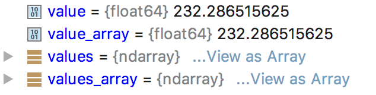

# Python API：解码

## codes_get

```py
value = codes_get (gid, key, ktype=None)
```

按原生格式返回 gid 指向的消息中 key 的值。可以使用参数 ktype 指定返回类型（int，str 或 float）

## codes_get_array

```py
values = codes_get_array (gid, key, ktype=None)
```

以 NumPy ndarry 或 Python 数组的格式返回数组 key 的内容，ktype 只能是 int 或 float。

## codes_get_values

```py
values = codes_get_values (gid)
```

返回以 1 维数组形式返回数据值。

## 异常

出错时，会抛出 `CodesInternalError` 异常，包含 C API 接口的错误信息。

## 示例：

```py
from __future__ import print_function
import click
import eccodes


@click.command()
@click.argument('file_path')
def cli(file_path):
    with open(file_path, 'rb') as f:
        handle = eccodes.codes_grib_new_from_file(f, headers_only=False)
        while handle is not None:
            date = eccodes.codes_get(handle, "dataDate")
            type_of_level = eccodes.codes_get(handle, "typeOfLevel")
            level = eccodes.codes_get(handle, "level")
            values = eccodes.codes_get_array(handle, "values")
            value = values[-1]
            values_array = eccodes.codes_get_values(handle, "values")
            value_array = values[-1]

            print(date, type_of_level, level, value)

            eccodes.codes_release(handle)
            handle = eccodes.codes_grib_new_from_file(f, headers_only=False)


if __name__ == "__main__":
    cli()
```

从上面代码看，我使用的版本 2.6.0 中，`codes_get_array` 和 `codes_get_values` 返回数据值都是 `ndarry` 类型。


