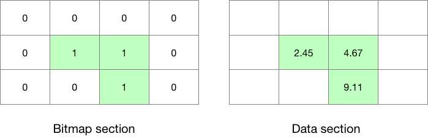

# 位图（Bitmap）

位图是二进制值的数组，用于表示每个网格点存在或缺失数据。0 值表示着数据缺失（missing），1 值表示数据存在。

为了节省存储，位图用于有效地表示数据段中真实存在的值。



bitmap 尺寸等于网格点的个数（`numberOfPoints`）。其中：

- `0` -> 数据值缺失
- `1` -> 数据值存在

当编码时，可以使用 `misssingValue` 告诉库那些数据是缺失的。

默认的缺失值是 9999，但可以被用户修改。例如，使用一个超过正常范围的数值。

库在数据值数组中遇到与缺失值相等的值时，会将该网格点对应的 bitmap 点设为 0.

在解码时，可以直接查询 bitmap 发现缺失的数据。

## 练习

1. 构造包含 4 个消息的 start.grib2 文件。

构造 4 个 filter 规则

```
# step0.filter
print "message 1";
set bitsPerValue=8;
set bitmapPresent=0;
set values={0.2, 0.4, 0.6, 0.7, 9999};
write;

# step1.filter
print "message 2";
set bitsPerValue=16;
set bitmapPresent=0;
set values={0.2, 0.4, 0.6, 0.7, 9999};
append;

# step2.filter
print "message 3";
set bitsPerValue=24;
set bitmapPresent=0;
set values={0.2, 0.4, 0.6, 0.7, 9999};
append;

# step3.filter
print "message 4";
set bitsPerValue=8;
set bitmapPresent=1;
set values={0.2, 0.4, 0.6, 0.7, 9999};
append;
```

使用 `grib_filter` 创建文件：

```
$ grib_filter -o start.grib2 step0.filter c.grib2
$ grib_filter -o start.grib2 step1.filter c.grib2
$ grib_filter -o start.grib2 step2.filter c.grib2
$ grib_filter -o start.grib2 step3.filter c.grib2
```

2. 打印数值

```
$ cat print.filter 
print "[values]";
print "[maximum]";

$ grib_filter print.filter start.grib2 
0.2 0.4 0.6 0.7 9999
9999
0.2 0.4 0.6 0.7 9999
9999
0.2 0.4 0.6 0.7 9999
9999
0.2 0.4 0.6 0.7 9999
0.7
```

可以看到，设置 bitmap 后，9999 被识别为缺失值。
